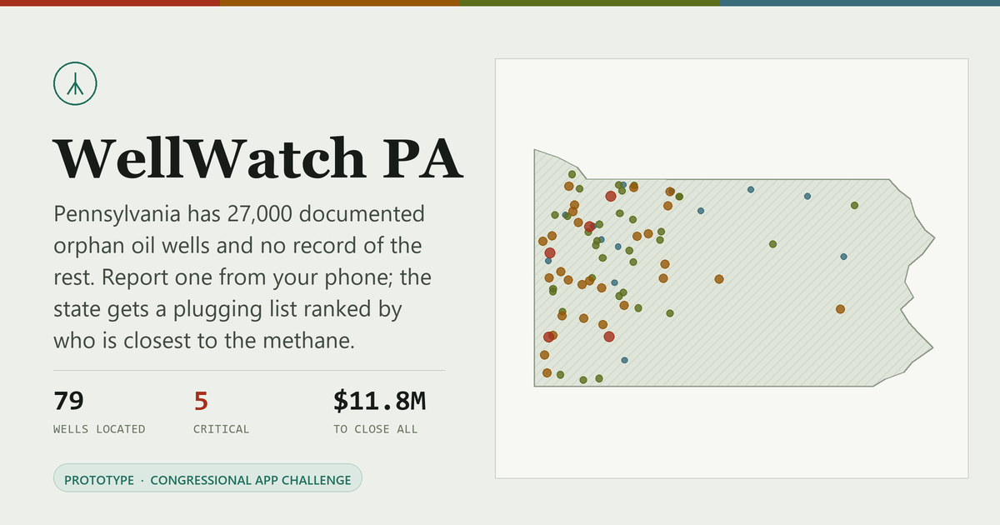

# WellWatch PA

**Report an abandoned Pennsylvania oil well from your phone. The state gets a plugging list ranked by who lives closest to the methane.**

[**Live app**](https://viktorxwang.github.io/wellwatch-pa/) · Congressional App Challenge 2026 · Pennsylvania



> **Before you submit:** add your demo video link and district below. Both are required by the
> Challenge, and the video carries two of the six rubric rows on its own.
>
> - Demo video: `TODO: YouTube or Vimeo, public, 1 to 3 minutes`
> - District: `TODO: PA-XX`

---

## The problem

Pennsylvania drilled the world's first commercial oil well at Titusville in 1859 and spent the next
century not writing down where the holes went.

| | |
|---|---|
| Documented orphan and abandoned wells | **~27,000** |
| Credible estimate of undocumented wells | **100,000 to 560,000** |
| Wells plugged by DEP in three years | **~400** |
| Federal formula grant available | **$114.6M** |

These wells vent methane, leak brine into streams, and occasionally fill basements with explosive gas.
The money is real but finite. At current cost per well it closes a small fraction of the inventory,
which makes the ordering of that list the entire problem.

Two people need something that does not exist today. A resident who finds a rusted pipe on their
property has no easy way to report it. A DEP planner with a fixed grant has no ranked queue telling
them which wells to close first.

## What it does

**Triage queue.** Every located well ranked 0 to 100, filterable by county and risk tier, plotted on a
projected map of the state.

**Well detail.** The full score breakdown for any well, so a ranking can be argued with instead of
taken on faith.

**Field report.** Drop a pin, answer four plain-language questions, watch the score compute live, and
see where your report lands in the queue.

**Plugging planner.** Set a grant amount and compare two allocation strategies against it. This is the
screen the project is really about.

## Try it

The app is a single self-contained page. No build step, no dependencies, no server.

```bash
open index.html
```

Or serve the folder if you would rather have a local origin:

```bash
python -m http.server 8000
```

The only external request is to Google Fonts, and the page falls back to system faces if that is blocked.

## How the risk model works

Six weighted factors, 100 points. Deliberately transparent and hand-auditable rather than learned: a
model that decides how public money gets spent should be explainable to the person it affects.

| Factor | Max | Why it carries that weight |
|---|---:|---|
| Occupied structure proximity | 30 | Methane migration into basements is the acute life-safety hazard |
| Surface methane concentration | 25 | Measured ppm at the wellhead |
| Water resource proximity | 15 | Brine and hydrocarbon migration into streams and water wells |
| Age and record quality | 12 | Pre-1900 completions have no construction records |
| Sensitive site within 1,500 ft | 10 | Schools, daycares, hospitals |
| Wellbore physical condition | 8 | Open hole, deteriorated, or intact |

Tiers: **Critical** ≥ 70 · **High** 50–69 · **Moderate** 30–49 · **Low** < 30

## The planner, and why it matters

Allocating a fixed budget across wells with different costs is a 0/1 knapsack problem. The planner
solves it greedily two ways and shows the gap:

- **Highest risk first.** The intuitive approach. Deep, expensive wells eat the grant early.
- **Risk retired per dollar.** Rank by `score ÷ cost`.

At a $3.5M budget against the current inventory, the second strategy funds **32 wells and retires 1,805
risk points**, against **23 wells and 1,529 points** for the first. Same money, nine more wells closed.

That comparison is the argument of the whole project. The ranking is not decoration; it changes what
the grant buys.

## Built with

| Layer | Choice |
|---|---|
| Runtime | Vanilla HTML, CSS and JavaScript. Zero dependencies, zero build |
| Rendering | Hand-rolled SVG map with an equirectangular projection fitted to PA |
| Type | Zilla Slab, Public Sans, IBM Plex Mono |
| State | `localStorage` for submitted citizen reports |
| Hosting | GitHub Pages |

No framework. The whole app is one 53KB file that opens from disk, which matters for a demo that has to
run without fail on someone else's machine.

## Technical problems worth naming

*The Challenge submission asks what technical difficulty you hit and how you solved it. These are the
honest answers for this build.*

**Contrast that failed where I was not looking.** Checking tier colours against a single background
turned up two failures. Re-checking against every surface each colour actually paints on (the page, the
panel, the tinted chip), three of four failed WCAG AA at their worst case, as low as 3.43:1. I solved
for hue-preserving replacements against the darkest background each colour touches, so `--high` moved
`#B26908 → #965807` and every tier now clears 4.5:1 everywhere it appears.

**Score bars that could not live in the stylesheet.** Each factor bar has a computed width and a
tier-dependent colour, which normally forces inline styles and scatters presentation across three
files. Passing `--pct` and `--bar` as CSS custom properties keeps the datum inline and the rule in the
stylesheet, where it can animate.

**Duplicate reports.** Two people photographing opposite sides of one wellhead should produce one well,
not two. Production handles this with a 60-metre `ST_DWithin` spatial match so the second report
becomes evidence on an existing well.

## Design and accessibility

The interface is deliberately not a generic dashboard.

- **Colour** is a desaturated olive-and-paper palette, not the default indigo gradient. Every tier
  colour is solved for at least 4.5:1 against all four backgrounds it renders on.
- **Motion** runs off two shared duration tokens and two curves, so every surface eases the same way.
  Interactions mean something: a hovered queue row grows an accent edge and slides toward the detail
  view it opens, and hovering the map dims every well except the one under the cursor.
- **Semantics** use real landmarks (`main`, `nav`, `article`, `section`), a skip link, screen-reader
  headings, ARIA tabs, and keyboard-activatable map markers.
- **`prefers-reduced-motion`** is respected throughout.
- **Dark mode** is a genuine second palette, not an inversion.

## About the data

> **The well data in this prototype is synthetic.**

Locations, depths, methane readings and plugging costs come from a seeded PRNG, not from measurement.
They are shaped to match the documented distribution of Pennsylvania's legacy wells, concentrated in
the Venango, Warren and McKean oil region, so the demonstration behaves realistically. **No individual
well on this map is a real well, and nothing here should inform a real siting or safety decision.**

A production deployment would replace the generator with DEP Oil & Gas Locations for the seed
inventory, USGS National Hydrography for stream distances, Microsoft US Building Footprints for
structure distances, and NCES for school locations, then write reports back through the DEP eFACTS
intake.

## What production would look like

The prototype runs entirely in the browser. The architecture it stands in for:

- **Client.** React + Vite PWA, offline-first. IndexedDB queue and Background Sync, because oil country
  has no cell coverage. MediaDevices and Geolocation for capture.
- **API.** FastAPI. `POST /reports`, `GET /wells`, `GET /plan`, `GET /export.csv`.
- **Domain services.** Versioned and pure, so a rubric change re-scores history: `score_v1`, `enrich`,
  `dedupe`, `allocate`.
- **Storage.** PostgreSQL + PostGIS with a GiST index for radius queries. Cloudflare R2 for field photos.

Server-side enrichment is the part that matters: a reporter's distance estimate gets replaced by a real
PostGIS measurement against building footprints and NHD flowlines.

## Repository

```
index.html     the entire application
preview.png    social/link preview card, generated from the app's own map data
LICENSE        MIT
```

## Status

Prototype built for the Congressional App Challenge. Not affiliated with or endorsed by the
Pennsylvania Department of Environmental Protection.

## License

MIT. See [LICENSE](LICENSE).
